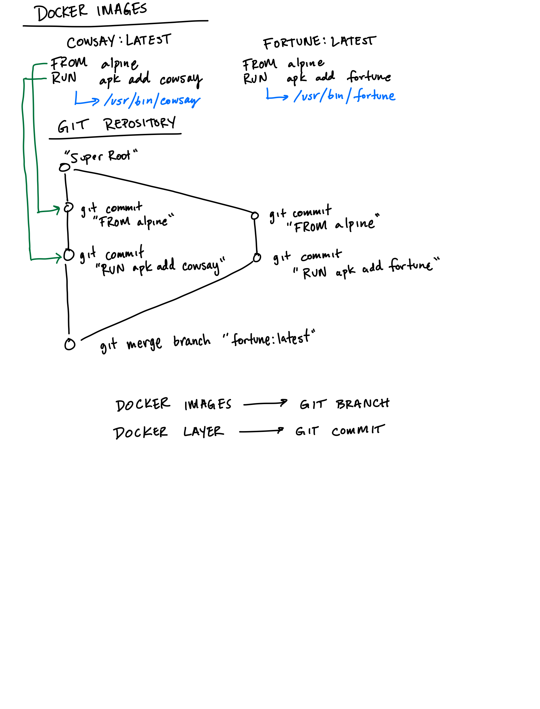

# Docker Merge

An interesting way to merge two arbitrary docker images.

Docker merge is a CLI utility that provides a proof-of-concept strategy to merge docker images. At its core - it utilizes the branching and merging ideas from git. It provides a conceptual link between Docker Images <=> Git Branches, and Docker Layers <=> Git Commits.

Want to try it out? Go to the [example](#Example).

Want to see how it works? [How it works](#How-it-works).



## Example

We're going to be merging two docker images - one that outputs fortunes, and another that embeds a message into an ASCII cow.

```
 ______________________________
/ Five is a sufficiently close \
| approximation to infinity.   |
|                              |
\ -- Robert Firth              /
 ------------------------------
        \   ^__^
         \  (oo)\_______
            (__)\       )\/\
                ||----w |
                ||     ||
```

### Installing

We're going to be building and merging two docker images. To get started, you'll need these two programs installed.

- Docker
- Git

First, install the `dgit` binary

**Linux**

```
curl -Lo dgit https://github.com/r2d4/docker-merge/releases/download/v1/dgit-linux-amd64 && chmod +x dgit && sudo mv dgit /usr/local/bin
```

**macOS**

```
curl -Lo dgit https://github.com/r2d4/docker-merge/releases/download/v1/dgit-darwin-amd64 && chmod +x dgit && sudo mv dgit /usr/local/bin
```

Clone this example repository to get the example Dockerfiles (or copy them yourself).

```
git clone https://github.com/r2d4/docker-merge.git && cd docker-merge
```

Next, we're going to be building two images that we're going to ultimately merge. The first is an alpine-based image that installs fortune, a binary that outputs a random fortune message. The second is another alpine-based image that installs cowsay, a binary that outputs a message in a speech bubble above an ASCII cow.

```
docker build -t fortune -f examples/getting-started/Dockerfile_fortune .
docker build -t cowsay -f examples/getting-started/Dockerfile_cowsay .
```

Now let's merge! We're going to tag the merged image as `cow-fortune` using the `-t` flag. The rest of the variadic arguments are images to merge, with the first being the image that "wins" in terms of merge conflicts.

```
dgit merge -t cow-fortune fortune:latest cowsay:latest
```

Finally, let's test it out!

```
docker run -it cow-fortune /bin/sh -c "fortune | cowsay"
```

```
 ___________________________
< r2d4 sure is a clever one >
 ---------------------------
        \   ^__^
         \  (oo)\_______
            (__)\       )\/\
                ||----w |
                ||     ||
```

## How it works

Conceptually, we want to map docker images to git branches, and docker layers to git commits. This allows us to hijack the "git merge" strategies to natively "merge" docker layers.

### Layers to Commits

For each image, we unpack the layers sequentially into a git repository. Similar to the docker snapshot mechanisms, we commit each layer. This means that every commit is the full representation of the overlayfs at each layer. Two things are done to make sure this works well. First, a "super root", from which all branches originate from, regardless of image. This is to make merges work, even without `--allow-unrelated-histories`. Second, we make sure that git commits are entirely reproducible. The commit SHA includes time of commit and author, so we use consistent metadata to make sure the same layers correspond to the same commits.

### Images to Branches

Each image becomes a branch. We arbitrarily pick the first image to use on the `main` or `master` branch. Every other image becomes its own branch. To finish, we use `git merge` across the branches, with merge strategy `ours` to resolve conflicts.

### Unintended Cool Stuff

- Every commit is the full representation of the overlayfs. This is interesting for debugging. You could also image that this is an alternative for building Docker images imperatively. That means that you can add files via commit rather than a Dockerfile `ADD` or `RUN` command.
- Native `diff` between layers. Want to understand what has changed from a particular `RUN` command? You can `git diff` between the output commits.
- Experimenting with merge strategies may yield interesting results for docker images.
- Abuse GitHub as a free Docker image repository with just a few minor changes. Better yet, add a registry that does this automatically for a specific URL.
